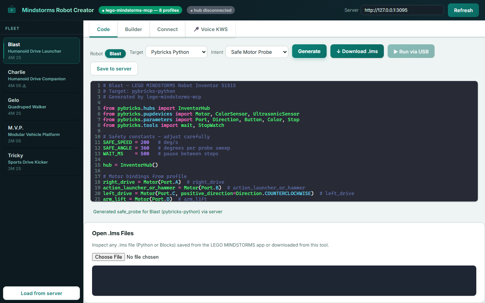
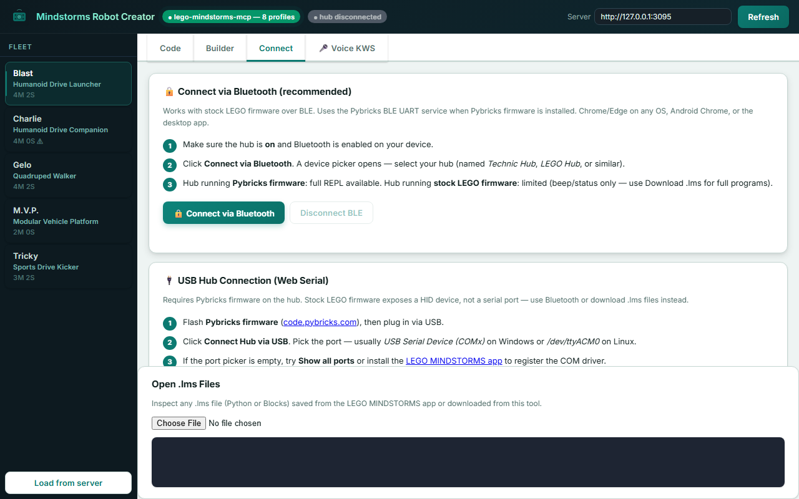
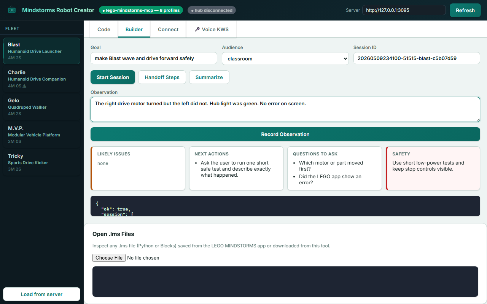
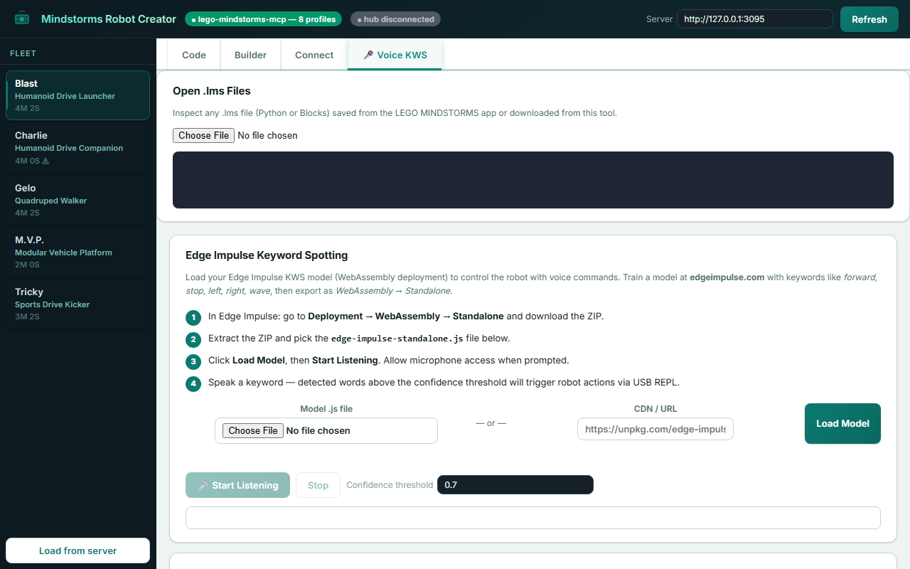

# Mindstorms Robot Creator

> Build, code, and control LEGO MINDSTORMS robots with AI.  
> Browser app · Desktop installer · Android app · MCP server


---

## Features

- **Code Generator** — pick a robot, pick an intent (beep, probe, drive, wave), get Pybricks or LEGO Stock Python in one click. Download as `.lms` file ready to load in the LEGO app.
- **Builder Session** — human-in-the-loop debug loop: propose one safe test, record what happened, get the next suggestion.
- **Connect** — Bluetooth (BLE, recommended) or USB Web Serial. Stock LEGO firmware supported via LWP3; full REPL with Pybricks.
- **Voice KWS** — load an Edge Impulse WebAssembly keyword-spotting model and control the robot by voice.
- **MCP Server** — 14 tools for AI agents (Claude Desktop, VS Code Copilot, Cursor). Zero runtime dependencies.

---

## Screenshots

| Code Generator | Connect via Bluetooth |
|---|---|
|  |  |

| Builder Session | Voice KWS |
|---|---|
|  |  |

> **Videos:** Run `npm run demo` to generate WebM recordings of each feature. Convert to GIF with ffmpeg — see script output for exact commands.

---

## Quick Start

### Browser / PWA

```bash
# Option A: serve the web-app folder from any static host
npx serve web-app

# Option B: start the local action server (enables Builder Session + code gen server-side)
npm start
# then open web-app/index.html in Chrome or Edge
```

### MCP Server (Claude Desktop / VS Code Copilot)

```bash
npx -y mindstorms-robot-creator
```

Add to `claude_desktop_config.json`:

```json
{
  "mcpServers": {
    "mindstorms-robot-creator": {
      "command": "npx",
      "args": ["-y", "mindstorms-robot-creator"]
    }
  }
}
```

Or in `.vscode/mcp.json`:

```json
{
  "servers": {
    "mindstorms-robot-creator": {
      "type": "stdio",
      "command": "node",
      "args": ["${workspaceFolder}/mcp-server.js"]
    }
  }
}
```

### Desktop App (Windows .exe)

Download the latest installer from [Releases](https://github.com/eoinjordan/mindstorms-robot-creator/releases).

Or build locally:

```bash
npm run electron:build:win
```

---

## MCP Tools

| Tool | Description |
|---|---|
| `robot_scan` | List all available robot profiles |
| `robot_describe` | Get port map, motors, sensors, capabilities |
| `robot_classify` | Classify probe telemetry into a morphology label |
| `builder_session_start` | Start a human-in-the-loop debug session |
| `builder_session_append` | Record an observation or debug note |
| `builder_session_summary` | Summarize session and suggest next action |
| `official_client_handoff` | Get handoff steps for the LEGO or Pybricks app |
| `probe_plan_create` | Generate a safe probing plan |
| `probe_run` | Execute a probe and capture telemetry |
| `dataset_export` | Export sessions as Edge Impulse JSON/CSV |
| `code_generate` | Generate Pybricks or LEGO Stock Python |
| `lms_write` | Create a `.lms` project file |
| `lms_read` | Read and inspect an `.lms` file |

---

## Hardware Support

| Family | Priority | Connection |
|---|---|---|
| Robot Inventor 51515 | 1 | BLE / USB (Pybricks or LWP3) |
| M5Stack Core + BaseX | 2 | USB serial, BLE, Wi-Fi |
| EV3 | 3 | USB, Bluetooth, Wi-Fi |
| NXT | 4 | Bluetooth Classic / USB |

---

## npm Publish

```bash
npm login
npm publish --access public
```

The package ships: `server.js`, `mcp-server.js`, `cli.js`, `adapters/`, `schemas/`, `examples/`, `web-app/`.

---


## Hardware Support Matrix

| Family | Priority | Connection | Control path | Feedback to collect | Notes |
| --- | ---: | --- | --- | --- | --- |
| Robot Inventor 51515 | 1 | BLE / USB depending firmware | Pybricks or LEGO SPIKE protocol adapter | motor angle/speed/load proxies, hub IMU, color sensor, distance sensor | First target. Seed robots are Blast, Charlie, Gelo, M.V.P., and Tricky. |
| M5Stack Core/Core2 + BaseX | 2 | USB serial, BLE, Wi-Fi | Arduino / ESP-IDF firmware with BaseX I2C driver | EV3/NXT motor encoder counts, speed, stall, command timing, IMU if Core2 | Best next bridge for robot probing and Edge Impulse deployment. |
| EV3 | 3 | USB, Bluetooth, Wi-Fi dongle | ev3dev Python service or SSH-deployed scripts | tacho position, speed, duty cycle, state, sensors, PixyCam data | Best legacy programmable brick target. ev3dev gives normal Linux tooling. |
| NXT | 4 | Bluetooth classic / USB | direct-command bridge, leJOS/NXC-compatible generator later | motor tachos, sensors | Good compatibility target, but Android Bluetooth Classic and old tooling are extra work. |
| RCX | 5 | IR tower via host bridge | host-side adapter only | weak motor feedback unless external sensors added | Treat as "legacy command target"; robot identification will need external observation or M5Stack/Pixy-style instrumentation. |

## App Responsibilities

The Android app should be the user-facing control and data collection tool, not the place where every compiler and cloud workflow lives.

Core screens:

- **Fleet**: scan/connect to M5Stack, EV3, SPIKE/Inventor, and known bridges.
- **Builder Session**: choose a robot goal, see the next safe step, record what happened, and keep a debug notebook.
- **Robot Profile**: hub type, ports, motors, sensors, battery, firmware, model deployments.
- **Probe Runner**: select safe probing routine, run it, watch live encoder/IMU/current traces, and abort quickly.
- **Dataset Capture**: label a build, record probe sessions, attach photos, notes, and optional Pixy/phone camera frames.
- **Classifier**: run on-device build recognition and confidence scoring.
- **Code Deploy**: choose a generated program, compile/build through MCP, deploy to the robot/controller.
- **Community Library**: import/export robot profiles, probe signatures, build instructions, and programs.

Implementation recommendation:

- Kotlin + Jetpack Compose.
- BLE and Bluetooth Classic adapters behind one `RobotTransport` interface.
- Local database with Room.
- Dataset files as JSONL/CBOR plus attachments, so they can be uploaded to Edge Impulse or used by local training later.
- Optional on-device inference using ExecuTorch for PyTorch models and Edge Impulse C++/TFLite for exported impulses.

## MCP Server Responsibilities

Use the same local-first posture as `minecraft-mcp`: narrow high-level tools, localhost by default, structured outputs, and explicit health/readiness checks.

Recommended tools:

- `robot_scan`: list available Android/host-connected devices and bridges.
- `robot_describe`: return detected hub, ports, motors, sensors, firmware, battery, and capabilities.
- `builder_session_start`: create a human-in-the-loop build/debug session for a profile and goal.
- `builder_session_append`: record a user observation, run result, fix, question, or note.
- `builder_session_summary`: summarize the latest observation and recommend the next safe debugging action.
- `official_client_handoff`: produce manual handoff steps for Robot Inventor 51515, EV3 Classroom, or local adapters.
- `probe_plan_create`: generate a safe probing plan for a given robot family.
- `probe_run`: execute a probe through the selected adapter and stream or store telemetry.
- `dataset_export`: write captured sessions as Edge Impulse ingestion JSON/CBOR, CSV, or local JSONL.
- `robot_classify`: run a local classifier against probe traces.
- `code_generate`: generate EV3 Python, Pybricks Python, Arduino firmware, or NXT command code from a robot profile and intent.
- `code_build`: delegate Arduino builds to `arduino-mcp`, Android builds to `android-mcp`, and Python syntax checks locally.
- `code_deploy`: send code to EV3, SPIKE/Pybricks, M5Stack, or an Android APK.
- `model_build_edge_impulse`: call `ei-agentic-claude` / Edge Impulse APIs to train and deploy.
- `model_package_executorch`: export/package a PyTorch model for Android or supported embedded targets.
- `profile_publish` and `profile_import`: share robot profiles and signatures.

Recommended repo split:

```text
lego-mindstorms-mcp/
  README.md
  package.json
  server.js
  adapters/
    m5stack-basex.js
    ev3dev.js
    pybricks.js
    spike-stock-protocol.js
    nxt-direct.js
    rcx-bridge.js
  schemas/
    robot-profile.schema.json
    probe-session.schema.json
    code-target.schema.json
    builder-session.schema.json
  examples/
    probes/
    profiles/
    programs/
  docs/
    android-app.md
    morphology-classifier.md
    community-network.md
```

Current scaffold:

- `server.js`: localhost action server with `/health`, `/ready`, `/actions`, and `/run`.
- `cli.js`: no-server command surface for agents and PowerShell workflows.
- `adapters/m5stack-basex.js`: simulated BaseX adapter for safe probe-loop development without hardware attached.
- `schemas/`: robot profile, probe session, code target, and builder session JSON schemas.
- `examples/profiles/51515/`: first Robot Inventor profiles for Blast, Charlie, Gelo, M.V.P., and Tricky.
- `examples/sessions/`: example human-in-the-loop builder/debug sessions.
- `examples/manuals/51515-manual-index.json`: local manual inventory and parse status.
- `android/robot-inventor-app/`: first Android profile/probe UI for the 51515 seed set.
- `examples/profiles/`: simulated fixtures for two-wheel drive, tracked vehicle, and gripper builds.
- `test-apps/builder-console/`: browser test app for builder, handoff, probe, and classify flows.
- `tests/`: Node built-in test runner coverage for action and CLI flows.
- `scripts/smoke.js`: runs simulated probe/classify checks across all seed profiles.

Run locally:

```powershell
node cli.js actions
node cli.js scan --plain
node cli.js builder start 51515-blast --goal "make Blast wave safely" --audience kid --plain
node server.js
node --test tests/*.test.js
node scripts\smoke.js
python -m pip install -r requirements.txt
python scripts\extract-51515-manuals.py
```

## Agent Documentation

Start here when using an agent to build this repo:

- `AGENTS.md`: repo operating guide for agents.
- `MCP_SERVER.md`: local action server and planned MCP surface.
- `docs/README.md`: index for architecture and workflow docs.
- `docs/CLI.md`: no-server command surface for agents and PowerShell workflows.
- `docs/HUMAN_IN_THE_LOOP_BUILDER.md`: builder/debug loop for agents, kids, and users.
- `docs/ANDROID_BUILDER_DESIGN.md`: current Android screen and test strategy.
- `docs/KID_SAFE_DEBUGGING.md`: safety and debugging checklist.
- `.agents/skills/lego-mindstorms-mcp/SKILL.md`: local skill for agents that support repo skills.
- `docs/sources/51515-profile-sources.md`: 51515 manual and online source notes.

## Robot Profile Schema

A robot profile is the shared object between the app, MCP server, generated code, and community library.

Minimum fields:

```json
{
  "id": "user-or-community-id",
  "name": "Driving Base 51515",
  "family": "m5stack-basex | ev3 | spike-prime | robot-inventor | nxt | rcx",
  "controller": {
    "model": "M5Stack Core2 + BaseX",
    "firmware": "arduino",
    "connection": ["ble", "usb-serial", "wifi"]
  },
  "ports": {
    "A": { "kind": "motor", "part": "ev3-large", "role": "left_drive" },
    "B": { "kind": "motor", "part": "ev3-large", "role": "right_drive" }
  },
  "sensors": [
    { "kind": "imu", "source": "controller" },
    { "kind": "camera", "source": "phone" }
  ],
  "probeSignature": {
    "version": 1,
    "features": ["step_response", "stall_current_proxy", "encoder_coupling", "imu_response"]
  },
  "programTargets": ["arduino", "ev3dev-python", "pybricks-python"],
  "license": "CC-BY-4.0"
}
```

## Probe Data

Use short, safe motor routines that are designed for classification, not performance testing.

Initial probes:

- single-port low-power step response
- paired motor opposite-direction response
- paired motor same-direction response
- small sinusoidal sweep
- gentle stall detection with immediate cutoff
- passive movement capture for user-pushed joints
- optional phone camera/Pixy object motion capture

Session format:

```json
{
  "sessionId": "uuid",
  "profileId": "optional-known-profile",
  "label": "driving-base | gripper-arm | crawler | unknown",
  "sampleRateHz": 50,
  "commands": [
    { "tMs": 0, "port": "A", "mode": "duty", "value": 20 }
  ],
  "telemetry": [
    {
      "tMs": 0,
      "ports": {
        "A": { "position": 0, "speed": 0, "duty": 20 },
        "B": { "position": 0, "speed": 0, "duty": 0 }
      },
      "imu": { "ax": 0, "ay": 0, "az": 9.8, "gx": 0, "gy": 0, "gz": 0 }
    }
  ],
  "attachments": []
}
```

## Model Strategy

Use simple models first. The valuable signal will come from good probing and labels, not from starting with a large network.

Phase 1 classifier:

- handcrafted features from traces: lag, overshoot, encoder ratio, left/right coupling, IMU response, stall flags
- scikit-learn or small Edge Impulse time-series classifier
- labels such as `two_wheel_drive`, `tracked_vehicle`, `arm`, `gripper`, `walker`, `unknown`

Phase 2 classifier:

- 1D CNN or temporal convolution over normalized command/telemetry windows
- optional late fusion with phone camera or Pixy object tracks
- anomaly score for "this does not match any known build"

Phase 3 self-model:

- learn a graph of ports and sensors using mutual information or dependency matrices from probe traces
- estimate which motors are mechanically coupled
- infer rough topology before selecting a code template

Deployment choices:

- **Edge Impulse**: best first path for M5Stack/ESP32 and Android because it already handles time-series ingestion, training, C++/Arduino export, and Android NDK examples.
- **ExecuTorch**: best for Android-hosted PyTorch models and future embedded PyTorch experiments. Keep it optional until there is a model that benefits from the PyTorch pipeline.
- **TFLite Micro / EON**: best constrained-device path for ESP32-class firmware.

## Code Generation Strategy

Do not generate raw low-level code first. Generate from templates plus a robot profile.

Targets:

- `arduino-basex`: M5Stack firmware that controls BaseX registers and streams telemetry.
- `ev3dev-python`: EV3 Python programs using tacho motors and sensor sysfs/ev3dev2 APIs.
- `pybricks-python`: SPIKE/Robot Inventor programs where Pybricks firmware is allowed.
- `spike-stock`: stock-firmware protocol commands for classroom-safe cases.
- `nxt-direct`: direct command scripts for NXT.
- `rcx-bridge`: host-side command relay for RCX.

Generated programs should include:

- capability declaration
- safe startup checks
- motor/sensor port binding
- telemetry streaming
- emergency stop
- versioned profile metadata

## Community Network

The network should be profile-first, not model-first.

Users contribute:

- robot profile JSON
- build instructions and photos
- probe sessions
- generated or hand-written programs
- model evaluation results
- hardware notes and failure cases

The server can then answer questions like:

- "What robot does this probe signature look like?"
- "What programs work for this build?"
- "Which model should run on this controller?"
- "Which probes are safe for this hardware?"
- "What sensors are missing to distinguish these two builds?"

Use content hashes for datasets and programs so profiles can reference artifacts without forcing all users into one central storage backend.

## First Milestone

Build the first full loop around Robot Inventor 51515:

1. Done: create `package.json` and a local REST/MCP-style action server scaffold.
2. Done: add the `robot-profile`, `probe-session`, `code-target`, and `builder-session` schemas.
3. Done: parse/inventory local 51515 manuals and seed the five official robot profiles.
4. Done: create an Android app scaffold that loads the 51515 profiles from assets.
5. Done: keep simulated probe/classify fixtures for hardware-free checks.
6. Done: add human-in-the-loop builder sessions and official LEGO client handoff actions.
7. Next: add Robot Inventor BLE/Pybricks connection path.
8. Next: record a real probe or builder session from one 51515 build.
9. Next: upload one labeled dataset to Edge Impulse through the ingestion path.

Acceptance test:

- With no hardware connected, simulated probes classify at least three fixture robot profiles.
- With BaseX connected, the app records a real probe session and exports it in the same schema.

## Source Links

- ev3dev: https://www.ev3dev.org/
- ev3dev tacho motors: https://www.ev3dev.org/docs/tutorials/tacho-motors/
- Pybricks docs: https://docs.pybricks.com/
- Pybricks Prime / Inventor hub: https://docs.pybricks.com/en/stable/hubs/primehub.html
- LEGO Wireless Protocol: https://lego.github.io/lego-ble-wireless-protocol-docs/
- LEGO SPIKE Prime protocol: https://lego.github.io/spike-prime-docs/
- LEGO Robot Inventor retirement/support note: https://www.lego.com/en-us/service/help-topics/article/About-MINDSTORMS-Robot-Inventor
- M5Stack BaseX docs: https://docs.m5stack.com/en/base/basex
- M5Stack Core2 docs: https://docs.m5stack.com/en/core/core2
- Edge Impulse Android docs: https://docs.edgeimpulse.com/tutorials/topics/android/android-series
- Edge Impulse C++ SDK: https://docs.edgeimpulse.com/tools/libraries/sdks/inference/cpp
- Edge Impulse Ingestion API: https://docs.edgeimpulse.com/reference/ingestion-api
- Edge Impulse deployment: https://docs.edgeimpulse.com/docs/edge-impulse-studio/deployment
- Edge Impulse EON compiler: https://docs.edgeimpulse.com/studio/projects/deployment/eon-compiler
- ExecuTorch overview: https://docs.pytorch.org/executorch/stable/intro-overview.html
- ExecuTorch Android: https://docs.pytorch.org/executorch/stable/using-executorch-android.html
- ExecuTorch embedded platforms: https://docs.pytorch.org/executorch/stable/platforms-embedded.html
- Robot morphology self-discovery: https://doi.org/10.1126/scirobotics.adh0972
- Robot body schema learning from extero/proprioception: https://doi.org/10.48550/arXiv.2402.18675
- Full-body visual self-modeling: https://doi.org/10.1126/scirobotics.abn1944
